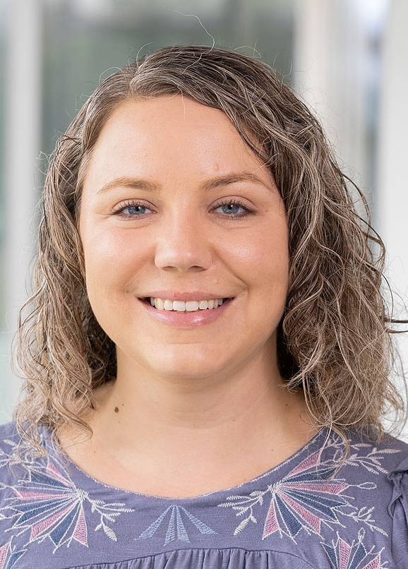

---
# Feel free to add content and custom Front Matter to this file.
# To modify the layout, see https://jekyllrb.com/docs/themes/#overriding-theme-defaults

layout: home
title: Home
header:
  image: /assets/luke-chesser-JKUTrJ4vK00-unsplash.jpg
  overlay_image: /assets/luke-chesser-JKUTrJ4vK00-unsplash.jpg
  overlay_filter: 0.4
  caption: "Photo credit: [**Unsplash**](https://unsplash.com)"
carousels:
  - images:
    - image: /assets/mathfest2024/officers-plus-winner-2024.png
    - image: /assets/mathfest2024/business-meeting-2024.png
    - image: /assets/mathfest2024/officers-2024.png
    - image: /assets/mathfest2024/speaker-2024-start.png
    - image: /assets/mathfest2024/speaker-start-2.png
    - image: /assets/mathfest2024/speaker-2024.png
    - image: /assets/mathfest2024/speaker-2024-thanks.png
    - image: /assets/mathfest2024/room-2024.png
    - image: /assets/mathfest2024/officers-speaker-2024.png
---

## Welcome

The purpose of this SIGMAA is to facilitate the exchange of ideas about teaching statistics and data science, the undergraduate statistics and data science curricula and all other issues related to providing students with effective and engaging encounters with these topics in their courses of study.  We also hope to foster increased understanding of statistics and data science among members of the MAA, promote the discipline of statistics and data science among students, and work cooperatively with other organizations to encourage effective teaching and learning of statistics and data science.

The SIGMAA SDS-Ed awards the Robert V. Hogg Award and the Dexter C. Whittinghill III Award at the SIGMAA business meeting at MathFest annually.

## News

### Nominations Open for the Robert V. Hogg Award for Excellence in Teaching Introductory Statistics

The Hogg Award provides recognition to an individual who has shown both excellence and growth in teaching introductory statistics at the college level. This award is presented annually in August at MathFest. Nomination packets for 2026 should be submitted to Helen Burn, Chair of the Award Committee, at [hburn@highline.edu](mailto:hburn@highline.edu).

The winner of the Hogg Award will have been teaching introductory statistics at the college level for 3 to 15 years and hold active membership with the MAA. Nominations of faculty coming from a mathematics background are especially encouraged, although all eligible candidates are encouraged to apply. The deadline for submitting nomination packets is **September 30, 2026**; nominations are held in consideration for 3 years, but updated nomination packets are encouraged. Please note nominees must be **MAA members** at time of nomination.

- [Award Nomination Information](https://docs.google.com/document/d/1lQmHzuSOLMG9oN2qz0BoWBinmo8KUO6aC0W9Hkgu0cM/edit?usp=sharing)
- [Nomination Cover Sheet](/Hogg_award/SIGMAA-Award-Nomination-Cover-Sheet.pdf)

### Awards

We are pleased to announce the recipients of two prestigious awards from the SIGMAA on Statistics and Data Science Education. The awards will be presented at MathFest 2026.

Congratulations to **Dr. Judith Canner**, Professor of Statistics at California State University Monterey Bay, for receiving the 2025 *Robert V. Hogg Award for Excellence in Teaching Introductory Statistics*! Dr. Canner has made significant contributions to our field and is a deserving recipient of this recognition, awarded to individuals demonstrating both excellence and growth in teaching introductory statistics at the college level.

Congratulations also to **Dr. Jo Hardin**, Professor of Mathematics and Statistics at Pomona College, for receiving the 2025 *Dexter C. Whittinghill III Award for Outstanding Contributed Paper in Statistics Education* at MathFest 2025! Their paper, titled Interdisciplinary Ethics in Data Science, focuses on a unique data science minor capstone course dedicated entirely to interdisciplinary ethics. Dr. Hardin’s outstanding presentation can be found here.

[Past Award Winners](/awards)

### Mathfest 2025

The section hosted [two main events]()  during Mathfest 2025

- The **SIGMAA SDS-Ed Business Meeting**
- A contributed paper session on **Advancing Data Science Education: Integrating Pedagogical Innovation with Ethical Practice.**

[See this post for presentation slides and photos]()

### JMM 2025

The section organized a [panel]() on Friday, January 10, 10:30 AM - 12:00 PM, titled *SIGMAA Statistics and Data Science Education Panel: Navigating the Frontier: Statistics, Data Science, and AI in the First Two Years of College*. Details can be found on the linked post.

### MathFest 2024
The section [held two events]() at [MathFest 2024](https://maa.org/meetings/maa-mathfest), on Friday, Aug 9 in room 309-310:

- A **contributed paper session** on *Community-Focused Experiences in the Statistics or Data Science Classroom*.
- The **section business meeting**, including a presentation from Dr. Sarah Kessler of the Indiana Fever on *Performance Analytics in Professional Basketball*.

[See this post for presentation slides and photos]()

{% include carousel._html height="50" unit="%" duration="5" number="1" scaling="0.8" %}

## Future Conferences of Interest to SIGMAA-SDS-Ed Members

- [eCOTS 2026](https://www.causeweb.org/cause/ecots/ecots26), June 15-18, 2026
- [Joint Statistical Meetings 2026](https://ww2.amstat.org/meetings/jsm/2026/), August 1-6, 2026, Boston, MA
- [MathFest 2026](https://maa.org/meetings/maa-mathfest), August 5-8, 2025, Boston, MA
- [Joint Mathematics Meetings 2027](https://jointmathematicsmeetings.org/jmm), January 12-15, 2027, Chicago, IL
- [CAUSE events](https://causeweb.org/cause/events)
