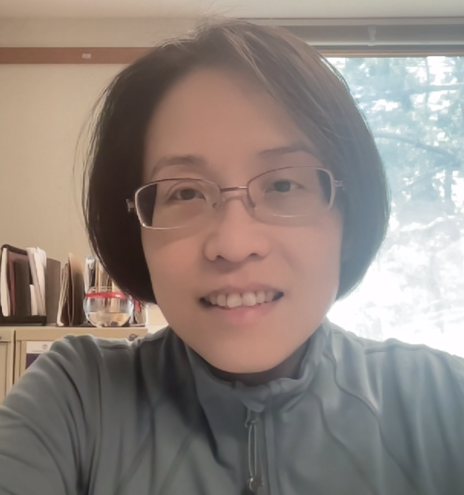

---
# Feel free to add content and custom Front Matter to this file.
# To modify the layout, see https://jekyllrb.com/docs/themes/#overriding-theme-defaults

layout: home
title: Home
header:
  image: /assets/luke-chesser-JKUTrJ4vK00-unsplash.jpg
  overlay_image: /assets/luke-chesser-JKUTrJ4vK00-unsplash.jpg
  overlay_filter: 0.4
  caption: "Photo credit: [**Unsplash**](https://unsplash.com)"
carousels:
  - images:
    - image: /assets/mathfest2024/officers-plus-winner-2024.png
    - image: /assets/mathfest2024/business-meeting-2024.png
    - image: /assets/mathfest2024/officers-2024.png
    - image: /assets/mathfest2024/speaker-2024-start.png
    - image: /assets/mathfest2024/speaker-start-2.png
    - image: /assets/mathfest2024/speaker-2024.png
    - image: /assets/mathfest2024/speaker-2024-thanks.png
    - image: /assets/mathfest2024/room-2024.png
    - image: /assets/mathfest2024/officers-speaker-2024.png
---

## Welcome

The purpose of this SIGMAA is to facilitate the exchange of ideas about teaching statistics and data science, the undergraduate statistics and data science curricula and all other issues related to providing students with effective and engaging encounters with these topics in their courses of study.  We also hope to foster increased understanding of statistics and data science among members of the MAA, promote the discipline of statistics and data science among students, and work cooperatively with other organizations to encourage effective teaching and learning of statistics and data science.

The SIGMAA SDS-Ed awards the Robert V. Hogg Award and the Dexter C. Whittinghill III Award at the SIGMAA business meeting at MathFest annually.

## News

### Nominations Open for the Robert V. Hogg Award for Excellence in Teaching Introductory Statistics

The Hogg Award provides recognition to an individual who has shown both excellence and growth in teaching introductory statistics at the college level. This award is presented annually in August at MathFest. Nomination packets for 2025 should be submitted to Helen Burn, Chair of the Award Committee, at [hburn@highline.edu](mailto:hburn@highline.edu).

The winner of the Hogg Award will have been teaching introductory statistics at the college level for 3 to 15 years and hold active membership with the MAA. Nominations of faculty coming from a mathematics background are especially encouraged, although all eligible candidates are encouraged to apply. The deadline for submitting nomination packets is **September 30, 2025**; nominations are held in consideration for 3 years, but updated nomination packets are encouraged. Please note nominees must be **MAA members** at time of nomination.

- [Award Nomination Information](https://docs.google.com/document/d/1lQmHzuSOLMG9oN2qz0BoWBinmo8KUO6aC0W9Hkgu0cM/edit?usp=sharing)
- [Nomination Cover Sheet](/Hogg_award/SIGMAA-Award-Nomination-Cover-Sheet.pdf)

### Awards

Congratulations to **Shonda Kuiper**, Grinnell College, for receiving the 2024 Dexter C. Whittinghill III Award for Outstanding Contributed Paper in Statistics Education at MathFest 2024!

Congratulations to **Dr. Shu-Min Liao**, Assistant Professor of Statistics at Amherst College, for receiving the 2024 Robert V. Hogg Award for Excellence in Teaching Introductory Statistics!

<!-- [Link to the full announcement](Hogg_award/Hogg-Announcement-Award-Announcement-2023b.docx) -->

[Past Award Winners](/awards)

### JMM 2025

The section is organizing a [panel](https://meetings.ams.org/math/jmm2025/meetingapp.cgi/Session/11019) on Friday, January 10, 10:30 AM - 12:00 PM, titled [*SIGMAA Statistics and Data Science Education Panel: Navigating the Frontier: Statistics, Data Science, and AI in the First Two Years of College*](https://meetings.ams.org/math/jmm2025/meetingapp.cgi/Session/11019).

Moderator
: *Helen Burn*, Chair SIGMAA Statistics and Data Science Education

Panelists
: - *Patti Frazer Lock*, St. Lawrence University
  - *Jamie Perrett*, Brigham Young University
  - *Kelly McConville*, Bucknell University
  - *Victor Piercey*, Ferris State University

Description
: The fast-evolving educational landscape, particularly in statistics, data science, and AI, underscores the importance of integrating these subjects in the first two years of college. This panel convenes experts to explore teaching challenges and opportunities, emphasizing early college courses. Attendees will gain insights into curriculum design and teaching methods, preparing students for success in a data-driven society.

### MathFest 2024
The section [held two events]() at [MathFest 2024](https://maa.org/meetings/maa-mathfest), on Friday, Aug 9 in room 309-310:

- A **contributed paper session** on *Community-Focused Experiences in the Statistics or Data Science Classroom*.
- The **section business meeting**, including a presentation from Dr. Sarah Kessler of the Indiana Fever on *Performance Analytics in Professional Basketball*.

[See this post for presentation slides and photos]()

{% include carousel._html height="50" unit="%" duration="5" number="1" scaling="0.8" %}

## Future Conferences of Interest to SIGMAA-SDS-Ed Members

- [Joint Mathematics Meetings 2025](https://jointmathematicsmeetings.org/jmm), January 8-11, 2025, Seattle, WA
- [USCOTS 2025](https://www.causeweb.org/cause/uscots/uscots25), July 17-19, 2025, Ames, Iowa
- [Joint Statistical Meetings 2025](https://ww2.amstat.org/meetings/jsm/2025/), August 2-7, 2025, Nashville, TN
- [MathFest 2025](https://maa.org/meetings/maa-mathfest), August 6-9, 2025, Sacramento, CA
- [CAUSE events](https://causeweb.org/cause/events)
