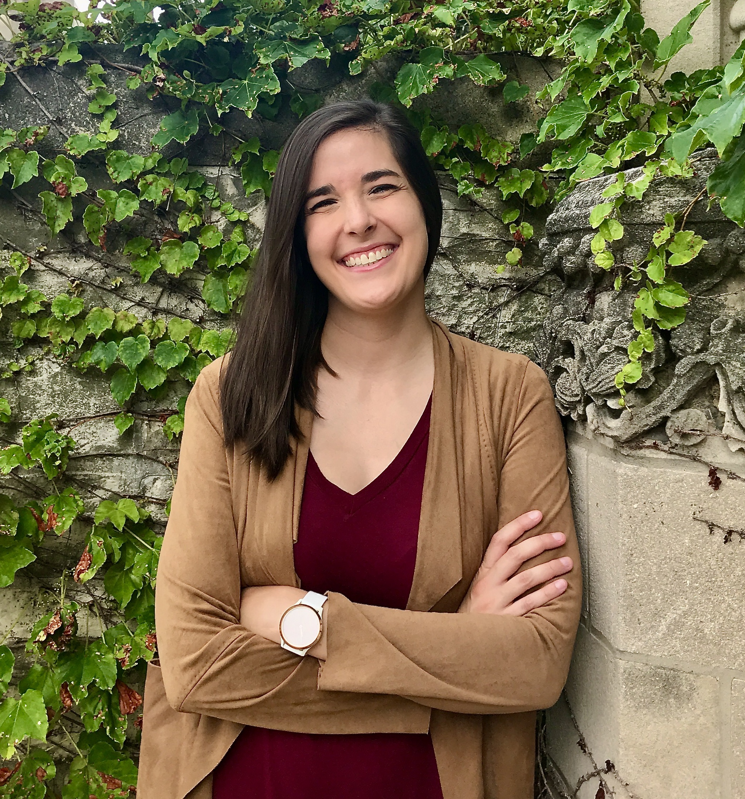

---
# Feel free to add content and custom Front Matter to this file.
# To modify the layout, see https://jekyllrb.com/docs/themes/#overriding-theme-defaults

layout: home
title: Home
header:
  image: /assets/luke-chesser-JKUTrJ4vK00-unsplash.jpg
  overlay_image: /assets/luke-chesser-JKUTrJ4vK00-unsplash.jpg
  overlay_filter: 0.4
  caption: "Photo credit: [**Unsplash**](https://unsplash.com)"
---

## Welcome

The purpose of this SIGMAA is to facilitate the exchange of ideas about teaching statistics and data science, the undergraduate statistics and data science curricula and all other issues related to providing students with effective and engaging encounters with these topics in their courses of study.  We also hope to foster increased understanding of statistics and data science among members of the MAA, promote the discipline of statistics and data science among students, and work cooperatively with other organizations to encourage effective teaching and learning of statistics and data science.

The SIGMAA SDS-Ed awards the Robert V. Hogg Award and the Dexter C. Whittinghill III Award at the SIGMAA business meeting at MathFest annually.

## News

We will be holding elections for Chair-Elect (1 year) and Secretary-Treasurer (2 years, elected in even years) in the Fall 2023 – please consider running for office or nominating a colleague. New terms begin January 1.

## Nominations Open for the Robert V. Hogg Award for Excellence in Teaching Introductory Statistics

The Hogg Award provides recognition to an individual who has shown both excellence and growth in teaching introductory statistics at the college level. This award is presented annually in August at MathFest. Nomination packets for 2024 should be submitted to Jeremy Case, Chair of the Award Committee, at [jrcase@taylor.edu](mailto:jrcase@taylor.edu).

The winner of the Hogg Award will have been teaching introductory statistics at the college level for 3 to 15 years and hold active membership with the MAA. Nominations of faculty coming from a mathematics background are especially encouraged, although all eligible candidates are encouraged to apply. The deadline for submitting nomination packets is **September 30, 2024**; nominations are held in consideration for 3 years, but updated nomination packets are encouraged. Please note nominees must be **MAA members** at time of nomination.

- [Award Nomination Information](https://docs.google.com/document/d/1lQmHzuSOLMG9oN2qz0BoWBinmo8KUO6aC0W9Hkgu0cM/edit?usp=sharing)
- [Nomination Cover Sheet](/Hogg_award/SIGMAA-Award-Nomination-Cover-Sheet.pdf)

## Awards

Congratulations to **Dr. Kaitlyn Fitzgerald** from Azusa Pacific University for receiving the 2023 Dexter C. Whittinghill III Award for Outstanding Contributed Paper in Statistics Education at MathFest 2023!

Congratulations to **Dr. Daniel Showalter** from Eastern Mennonite University for receiving the 2023 Robert V. Hogg Award for Excellence in Teaching Introductory Statistics!

[Link to the full announcement](Hogg_award/Hogg-Announcement-Award-Announcement-2023b.docx)

[Past Award Winners](/awards)

## Future Conferences of Interest to SIGMAA-SDS-Ed Members

- [Joint Statistical Meetings](https://ww2.amstat.org/meetings/jsm/2023/), August 5-10, 2023, Toronto, Ontario, Canada
- [Joint Mathematics Meetings](https://www.jointmathematicsmeetings.org/meetings/national/jmm2024/2300_program.html), January 3-6, 2024, San Francisco, CA
- [MathFest](https://maa.org/meetings/maa-mathfest), August 7-10, 2024, Indianapolis, IN
- [Joint Statistical Meetings](https://ww2.amstat.org/meetings/jsm/2024/), August 3-8, 2024, Portland, OR
- [ECOTS](https://www.causeweb.org/cause/ecots/ecots24), May 28-May 31, 2024, State College, PA
- [CAUSE events](https://causeweb.org/cause/events)
